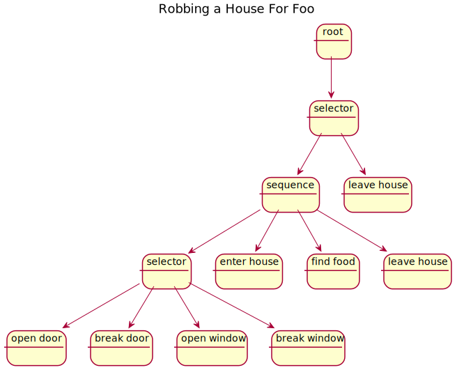

# AI Design

## Overview

The AI system uses AI trees to execute AI behaviour. Each node in the AI tree represents a method call that get's executed concurrently.

### Example AI Tree



The nodes work as follows

Selectors will execute their children until one of them is successful. If any node is successful is succeeds, otherwise it fails.

A sequence executes it's children in order, stopping after any node fails. It succeeds if all of it's children succeed.

Each node corresponds to a method to execute.

### Method Binding
Method binding happens via reflection. Nodes specify a class, method, and a set of arguments, and they are bound dynamically at runtime.
Look to [Method Binding Documentation](../MethodBindings/MethodBinding.md) for details.

``` c#
// This is an example of an AI method that succeeds after 1 frame has passed.
// The AI Execution Context contains context dependant information about this 
// nodes execution, including a reference to the gameObject, a list of children 
// nodes, and a reference to the AI's memory, and the arguments for the current 
// AI tree.
[AIMethod]
IEnumerator<AIResult> AIMethod(AIExecutionContext context)
{
    // Returning a running status will advance 1 frame
    yield return AIResult.Running

    // Returning a success status will indicate this node has succeeded
    // Nodes should short circuit when a success of failure result has been 
    // returned, but the runtime does not garentee that this happens. Therefore, 
    // any lines of code after a success yield return are not garenteed to 
    // execute.
    yield return AIResult.Success;
}
```